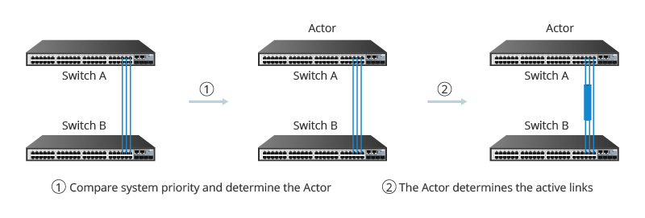
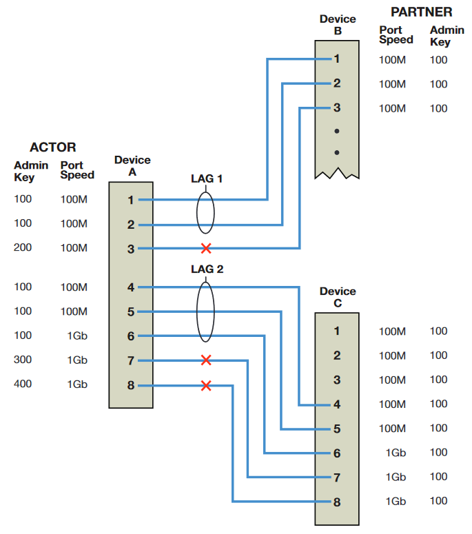

## Index

- [Before you begin](#before-you-begin)
- [Reset switch to factory settings]()
- [Update device to latest firmware]()
- [Stacking configuration]()
- [LAG configuration]()
- [Spanning tree configuration]()
- [VLAN configuration]()
- [DHCP configuration]()
- [SNTP configuration]()
- [Import and export of settings backup]()
- [User management]()
- [SSH, Telnet and WebView]()


### Before you begin

We'll start with a pair of Enterasys B5 switches. First of all, we choose [PuTTY](https://www.putty.org/) as our terminal emulation program. Besides, we'll also use [Tftp64](https://tftpd32.jounin.net/), an opensource software that includes a TFTP client to easily share data between laptop and switch. This protocol uses the 69 port.

To first link a switch to our laptop, we'll establish connection with the console port on the switch. For this, we'll need a RJ45-to-DB9 adapter.


### First time connection: reset to factory settings

1. Using the DB9 console port, we can open a CLI session with PuTTY, choosing a serial connection (COM port). Basic settings.
```
    Transmit speed or baud rate = 9600
    Data bits = 8
    Parity = None
    Stop bits = 1
    Mode = 7-bit control, if available
    Specify the appropriate COM port (check in device manager)
```

2. Power up switch.
3. Log in with **admin** user (no password).
4. Reset switch to factory settings ```reset system```. It's also possible to only remove config settings ```clear config all``` or IP settings ```clear ip address```.


### Set IP address and update firmware

1. Repeat serial connection via PuTTY, login with admin user.
2. Set switch IP address. ```set ip address 192.168.1.1 mask 255.255.255.0```Default value is 0.0.0.0.
3. Set your laptop IP address in the same subnet. Ex: 192.168.1.2.
4. Connect laptop to any switch front panel port.
5. Check connection with pings between laptop-switch and vice versa.


### Firmware update

1. Download latest version [here](https://extremeportal.force.com/ExtrDownloadLanding#q=b5%20firmware&sort=%40sfreleasedate__c%20descending), and unzip it in the shared TFTP folder.
2. Copy it via PuTTY: ```copy tftp://192.168.1.2/c5-series_06.61.01.0031 system:image```
3. Active the firmware and reboot the system. ```set boot system c5-series_06.61.01.0031```
4. After reboot, log in and ```dir``` to check if firmware file is both with active and boot status.
5. Just in case we want to delete another firmware file: ```delete c5-series_06.42.06.0008```


### Stacking configuration

Stacking means two or more switches can work as one single device. They’re useful to increase the capacity of the LAN, improving scalability. Stacking with Enterasys B5 is up to 8 switches. ELI5, you can get only one switch with a lot of ports.

One switch will work as a **Manager** switch (master), and it handles the general config, address tables, routing… Rest of switches work as **Members** (slaves) in the stack. The only file config is in the manager switch, and every 5 minutes it is pushed to the rest of members of the stack. To avoid data loss, run ```save config``` and wait for the prompt.

0. All switches must have the same firmware version, a clean configuration from factory and same licensing state (this one doesn’t apply here): ```show license```, ```clear license```
1. Connect cables and power up the switches, starting with the master. Each switch has two stack ports (up & down) behind, and ports are wide, next to power connector.
2. Establish CLI session in master and run ```show switch```
3. (*optional*) Set unit numbering manually: ```set switch member```. You can renumber with ```set switch renumber``` and the, clear original unit number with ```clear switch member```.
4. Set IP address if not done before.
5. Connect PC to front panel and upload firmware through TFTP (apparently, it also applies to members).
6. Reboot system with ```set boot system```.
7. After reboot, check firmware version with ```show switch```.
8. Extra config: create user, disable default ones, SSH/Telnet, config backup...

To add a new switch into a existing stack, new device must have same firmware version and clean factory settings. Then, just connect with stack down port (while power is off), power on the device and log into CLI to adjust config.


### Establish a CLI session

Two different ways: 

- Through console port (PuTTY serial). We can use default user ‘admin’. 
- SSH/Telnet (IP assigned in both switch and laptop, and front port connection).

Handy commands: ```cls```, ```<command> help```, ```<command> ?```, ```show <command> ?``` (this one for searching commands which begin with those words).


### Port sytax

It responds to this structure: name.N.M

The name is established depending on the port's speed.

| fe       | ge     | tg      | host      | vlan           | lag                   |
|----------|--------|---------|-----------|----------------|-----------------------|
| 100 Mbps | 1 Gbps | 10 Gbps | host port | vlan interface | link aggregation port |

N has values from 1 to 8, and corresponds to units in a stack. M is port number. For example, ge.3.1-10 references unit 3, ports 1 through 10 for 1-Gigabit Ethernet.

Commands: ```show port status```, ```set port [enable | disable] fe.2.40```


### Users management

1. Create new super-user ```set system login *NewAdmin* super-user enable```
2. Config password for *NewAdmin*: ```set password NewAdmin```. (min. 8 characters) 
3. Verify new account with ```show system login``` command 
4. You can also create read-write | read-only users.
```set system login <user-name> read-write enable```
```set system login <user-name> read-only enable```
5. Disable default logins.
```set system login admin super-user disable```
```set system login rw read-write disable```
```set system login ro read-only disable```


### Enable SSH, disable Telnet and WebView 

1. By default, Telnet is enabled and SSH is disabled: ```set ssh enable```, ```show ssh```, ```show ssh status```
2. Disable Telnet: ```set telnet disable inbound```, show telnet```. 
3. Disable WebView: ```set webview disable```, ```show webview```.
4. Default idle time is 5 minutes. Set to 30 minutes, for example:```set logout```, ```show logout```.


### Save and export backup config 

1. Save current settings: ```save config```
2. Save file *myconfig* locally: ```show config outfile configs/myconfig```
3. Export it using TFTP: ```copy configs/myconfig tftp://192.168.1.2/myconfig```
4. Import saved config: ```copy tftp://192.168.1.2/myconfig configs/myconfig```
5. Apply saved config: ```configure configs/myconfig append```


### VLAN config 

An independent logical group of network devices within the same physical location. It allows the segregation of the traffic, improving network security and administrative efficiency. By default, it already exists a VLAN ID = 1. 

1. Show existing VLANs: ```show vlan``` 
2. Create a new VLAN ```set vlan create 2 | 4094```, ```set vlan create 100```.
3. (*optional*) Add string to Id-Number: ```set vlan name vlanID string```, ```set vlan name 100 vlanZ``` 
4. Assign ports to VLAN: ```set port vlan portName vlanID```, ```set port vlan ge.1.2-4 100```.


### LAG config 

Link Aggregation is a standard, and LACP is a subcomponent of it. LAG allows to bundle multiple physical links between switches into a single logical link. Besides, it improves reliability without changing the physical infrastructure. In case one link fails, the rest of link members in the same LAG can balance the load.

Between two switches in LAG, the main one is an **Actor**, and the other one works as **Partner**. Both switches compare themselves to determine which will work as Actor. After that, the two switches will choose active ports based on the port priorities of Actor’s ports. In case all of them have the same priority level, the ports with smaller numbers will be chosen to be active ports. These are responsible of load balance data to do communication.




LAGs are formed automatically if LACP is enabled. Four basic rules for involved ports: 

- Operate in full duplex mode (default): can send and receive data simultaneously. 
- Port admin keys must match between them. Default value is 32768. 
- Operate in parallel. Only two devices can be involved in a LAG. 
- More than one port linked unless single port LAG feature is enabled. 



Example of two LAGs. In both cases, rules A, B and D are satisfied: full duplex mode, working in parallel and with more than one port pairing in each LAG. Since paired port match in speed terms, admin key value is the only criteria left. In both Partners, every port has a value of 100. Therefore, any port with a different admin key in Actor switch cannot be part of a LAG. 

1. Enable LACP on switch: ```set lacp enable```
2. Set maximum number of LAGs per switch: ```set lacp groups [ 6 | 12 | 24]```. Total of 48 switches: 	6 * 8 physical ports | 12 * 4 physical ports | 24 * 2 physical ports 
3. Don’t connect the paired ports physically, unless spanning tree is configured. 
4. Change admin key value for all LAGs (0-65535). That way, no LAGs will automatically form: ```set lacp aadminkey lag.0.* 65535```
5. Then, set admin key for needed LAGs: ```set lacp aadminkey lag.0.1 100```
6. Previous ones were logical values. Now, we’ll enable LACP port state and admin key values for physical ports:
```set port lacp port ge.1.1 aadminkey 100 enable```
```set port lacp port ge.1.2 aadminkey 100 enable``` 
```set port lacp port ge.1.3 aadminkey 100 enable``` 
```set port lacp port ge.1.4 aadminkey 100 enable``` 
7. In partner switch:
```set lacp aadminkey lag.0.* 65535``` 
```set lacp aadminkey lag.0.1 100```
```set port lacp port ge.2.25 aadminkey 100 enable``` 
```set port lacp port ge.2.26 aadminkey 100 enable``` 
```set port lacp port ge.2.27 aadminkey 100 enable``` 
```set port lacp port ge.2.28 aadminkey 100 enable```


### DHCP config 

1. Switch IP address must be configured: 
```set ip address 192.168.x.x mask 255.255.x.x gateway 192.168.x.x```
2. Enable DHCP: ```set dhcp enable```
3. Configure DHCP pool (same subnet and mask)
```set dhcp pool poolname network 192.168.x.x 255.255.x.x``` 


### Spanning tree config 

STP resolves the problem of physical loops in a network, establishing one primary path between any two devices. Duplicated paths are blocked until the primary path fails. They are handy in redundant links (like LAGs) while avoiding deadly loops for a network. A simple broadcast packet in a redundant infrastructure can collapse a network. In this case, STP would block redundant paths, breaking the loop. Spanning Tree is enabled by default on stackable switches on all ports, with version set to MSTP (802.1s) mode.

1. Review current configuration in one or more SIDs (spanning tree identifier) or ports. 
```show spantree stats [port ge.1.3] [sid 1] [active]```
2. Review the status of Spanning Tree on one or more ports: ```show spantree portadmin port ge1.3```.
3. Enable STP (already by default, with MSTP version): ```set spantree [enable | disable]```. 
SID 0 is the default spanning tree, and interconnect all bridges.


### SNTP to configure time automatically 

Manually: ```show time```. ```set time mm/dd/yyyy hh:mm:ss```.

(Simple Network Time Protocol), it allows synchronization of system time for network devices. Client queries the SNTP server at a fixed poll-interval ```sent sntp poll-interval```. There are also values for sntp poll-timeout and sntp-poll-retry in case there is no response. 

In unicast mode, client makes the requests. On the other hand, in broadcast mode, the client is passive and the server broadcasts the time (using same poll-interval, poll-timeout…). You could establish key for security reasons, but I don’t want to mess with that TBH. 

```set sntp client [unicast | broadcast | disable]``` (disabled by default) 
```set sntp server 192.168.x.x```, ```show sntp```, ```show summertime```
```set timezone ‘CET’ 1 0```
```set summertime enable CEST```
```set summertime recurring last Sunday March 02:00 last Sunday October 03:00 60```
